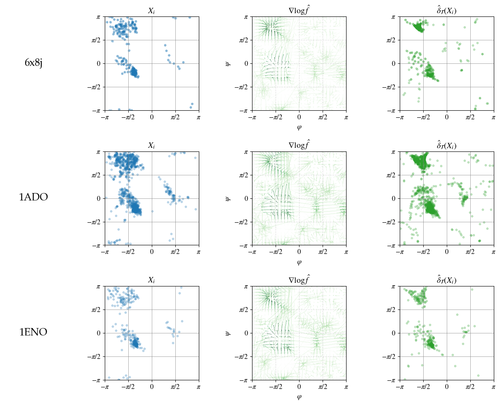
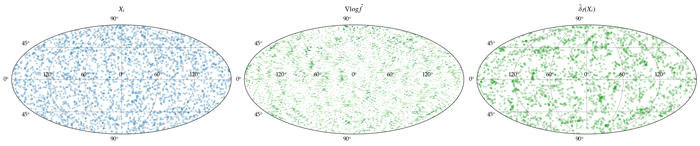

# Nonparametric Riemannian Empirical Bayes

by Adam Q. Jaffe, Leonardo V. Santoro, Bodhisattva Sen

Empirical Bayes approach to denoising measurements of latent variables that live on a compact Riemannian manifold, where the latent variables are assumed only to come from a distribution that possesses a density.  At the oracle level, we identify a denoiser achieving nearly the Bayes risk but which avoids the difficult computation of the posterior Fréchet mean as required by the Bayes denoiser.  
At the empirical level, we construct a fully data-driven approximation of this oracle denoiser by using a novel approximate Tweedie-Eddington formula for Riemannian Gaussian mixture models; we establish a finite-sample rate of convergence for this approximation which can be slower than the nearly-parametric rates from the Euclidean setting, due to the fact that Riemannian Gaussian distributions have weaker smoothing properties than Euclidean Gaussian distributions. Lastly, we implement our methodology in denoising problems from two scientific applications: in astronomy, the sphere-valued problem of denoising the locations of gamma ray bursts; in structural biology, the torus-valued problem of denoising pairs of torsion angles of adjacent amino acids in a protein (i.e., the Ramachandran plot).

---

> ⚠ **Work in progress:**
> This repository is under active development.

---
### Example: Denoising observations on manyfolds

### Example: Estimating Torsion Angles of Adjacent Amino Acids in a Protein

### Example: Denoising Gamma Ray Bursts (Astronomy Application)

---
