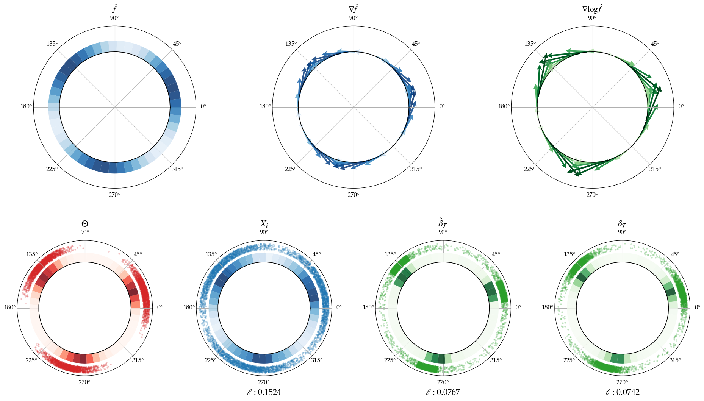
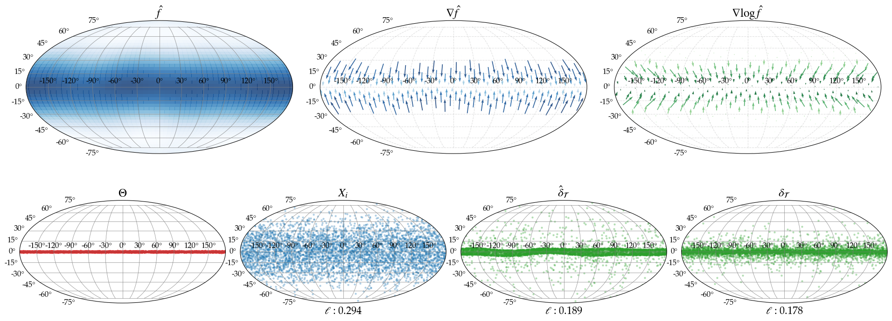

# Nonparametric Riemannian Empirical Bayes Denoising

> **Paper:** *Nonparametric Riemannian Empirical Bayes* — Adam Q. Jaffe, Leonardo V. Santoro, Bodhisattva Sen.

A fully data-driven denoiser for measurements of latent variables on compact Riemannian manifolds. Given noisy observations $X_i = \exp_{\Theta_i}(\sigma \varepsilon_i)$ of unknown latent points $\Theta_i$ on a manifold $\mathcal{M}$, the method recovers a denoised estimate $\hat\delta(X_i) \approx \Theta_i$ without assuming any parametric form for the prior distribution.

**Supported manifolds:** $S^1$ (circle), $S^2$ (sphere), $SO(3)$ (rotation group), $T^2$ (torus).

---

## How it works

1. **Spectral density estimation** — estimate $\hat f$ and its Riemannian gradient $\nabla \hat f$ from the data using a truncated eigenfunction expansion of the Laplace–Beltrami operator.
2. **Score estimation** — form the score $\nabla \log \hat f = \nabla \hat f \,/\, \max(\hat f,\,\rho)$, where $\rho > 0$ is a small regulariser.
3. **Tweedie-style denoising step** — apply the Riemannian exponential map:
$$\hat\delta(x) = \exp_x \bigl(\sigma^2 \,\nabla \log \hat f(x)\bigr)$$

Hyperparameters $(M, \rho)$ are selected automatically via K-fold cross-validation using the Hyvärinen score-matching loss.

---

## Installation

```bash
git clone https://github.com/leonardoVsantoro/REB-denoising.git
cd REB-denoising
pip install -e .
```

For the structural-biology example (requires BioPython):
```bash
pip install -e ".[bio]"
```

---

## Quick start

```python
import numpy as np
from reb import (
    get_manifold,
    multimodal_sampler,
    scoreMatchingKFoldCV,
    denoiser,
    sq_loss,
)

manifold_type = 'S1'          # circle — also 'S2', 'SO3', 'T2'
manifold      = get_manifold(manifold_type)
sigma2        = 0.15
n             = 2000

# 1. Generate data: sample prior, add Riemannian Gaussian noise
Theta = multimodal_sampler(manifold_type, n, tau2=0.05, num_modes=3)
X     = manifold.random_riemannian_normal(Theta, 1. / sigma2, n)

# 2. Select hyperparameters via cross-validation
params = scoreMatchingKFoldCV(manifold_type, X,
                               M_grid=np.arange(2, 12),
                               rho_percentile=np.arange(2, 20))
M, rho = params['AIC']

# 3. Denoise
delta = denoiser(manifold_type, X, M, rho, sigma2, X)

print(f"MSE (noisy):    {sq_loss(manifold, X,     Theta):.4f}")
print(f"MSE (denoised): {sq_loss(manifold, delta, Theta):.4f}")
```

---

## API reference

### Core

| Function | Description |
|---|---|
| `denoiser(manifold_type, X, M, rho, sigma2, X_to_denoise)` | Main denoising function |
| `density_estimate(manifold_type, X, M, on_X, grad, laplacian)` | Spectral density and gradient estimation |
| `scoreMatchingKFoldCV(manifold_type, X, M_grid, rho_percentile, ...)` | Hyperparameter selection via score-matching CV |
| `DensityKFoldCV(manifold_type, X, M_grid, rho_percentile, ...)` | Hyperparameter selection via density CV |

### Utilities

| Function | Description |
|---|---|
| `get_manifold(manifold_type)` | Return a `geomstats` manifold object |
| `get_obs_from_G(manifold_type, G, sigma2, n)` | Sample noisy observations from a prior |
| `sq_loss(manifold, X, delta)` | Mean squared geodesic distance |
| `oracle_denoiser(...)` | Oracle denoiser (requires access to true prior samples) |

### Priors (for simulation)

| Function | Description |
|---|---|
| `multimodal_sampler(manifold_type, n, tau2, num_modes)` | Mixture of Riemannian Gaussians |
| `uniform_sampler(manifold_type, n)` | Uniform distribution |
| `equator_sampler(manifold_type, n, tau2)` | Concentrated near a great circle (S2) |
| `dirac_sampler(manifold_type, n, n_points)` | Discrete mixture |

### Visualisation

Plotting utilities live in `reb.plotting`:

- **S1:** `S1scatter`, `S1_histogram`, `S1_score_quiver`, `S1_smooth_histogram`
- **S2:** `S2scatter`, `S2plot_quiver`, `S2grid`, `S2grid_fib`
- **T2:** `T2_scatter`, `T2plot_quiver`, `T2grid`, `T2_imshow`

---

## Examples

### Denoising on the circle (S1)

Three-modal prior with $\sigma^2 = 0.15$, $n = 5000$:



*Left to right: prior $\Theta$, noisy observations $X_i$, empirical Bayes denoised $\hat\delta_\mathcal{T}(X_i)$, oracle denoised $\delta_\mathcal{T}(X_i)$.*

### Denoising on the sphere (S2)

Equatorial prior:



### Application: Protein torsion angles (T2)

Denoising Ramachandran plots (phi-psi backbone dihedral angles) from PDB structures:


### Application: Gamma-ray burst locations (S2)

Denoising the sky positions of 1637 gamma-ray bursts from the BATSE 4B catalog:


---

## Running the examples

```bash
# Simulated data
python examples/circle_denoising.py
python examples/sphere_denoising.py

# Real data
python examples/real_data/astro.py
python examples/real_data/chemi.py   # requires biopython
```

---

## Project layout

```
reb/                        # installable package
├── denoiser.py             # main denoising function
├── density_estimation.py   # spectral density estimation
├── crossvalidation.py      # K-fold CV for hyperparameter selection
├── helpers.py              # manifold utilities
├── priors.py               # prior distribution samplers
├── oracle.py               # oracle denoiser (for benchmarking)
└── plotting/               # manifold-specific visualisation
    ├── S1.py
    ├── S2.py
    └── T2.py
examples/
├── circle_denoising.py
├── sphere_denoising.py
└── real_data/
    ├── astro.py            # gamma-ray burst application
    └── chemi.py            # protein torsion angle application
```
